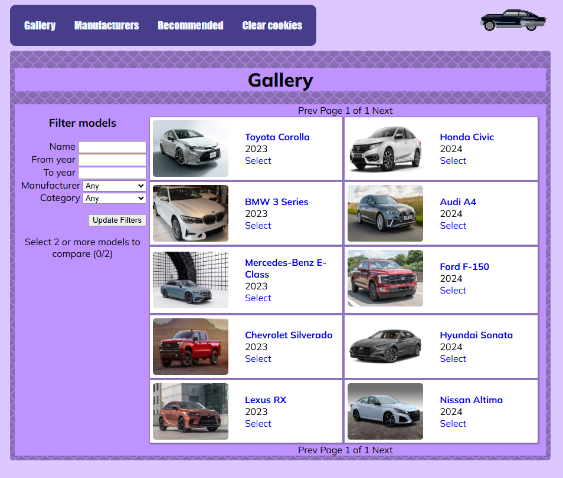

# cars-viewer

Martti Koivisto, Pyry Vainikainen



## Installation

Install node.js and the cars-api.

1. Node.js instalation guide for WSL2: https://learn.microsoft.com/en-us/windows/dev-environment/javascript/nodejs-on-wsl

2. Download build and run the cars-api (includes instructions): https://study.koodsisu.fi/api/file?gitpath=content/coding-fundamentals/coding-fundamentals-go/cars/viewer/_config/resources/api.zip

3. Clone the cars-viewer repo and build it. 

## Usage

```
go run . [-h] [-apiaddr API_ADDRESS] [-apipollrate API_POLL_RATE] [-serverport PORT_NUMBER]
```

For example,
```
go run . -apiaddr http://localhost:3001
```

Cars-viewer launches a web-server that fetches data from cars-api and presents the data in a browser-accessible web interface.

Cars-viewer can be shut down gracefully with interrupt signal (Ctrl+D).

#### pages

**/** View, filter and select car models for comparison.

**/compare/** Compare different models, supplied by the model selection

**/model/<id>** Detailed view of a model.

**/manufacturers/** View manufacturers.

**/recommendations/** View recommendations based on previously viewed and compared models. 

**/clearcookie/** Clear view history (recommendations).

#### Option flags

**-h** display usage help message and exit

**-apiaddr API_ADDRESS** override default address for the API (defaults to http://localhost:3000)

**-apiaddr API_ADDRESS** override default polling rate for the API (defaults to 30s)

**-serverport PORT_NUMBER** override default server port (defaults to :8080)

## Learning objectives
The project taught us
- Working with and manipulating external data sources (APIs).
- Understanding and working with JSON data format.
- Developing user interfaces using HTML.
- Implementing client-server interactions and handling events effectively.
- Using the Go programming language for web development.
- Adhering to best practices for web development.