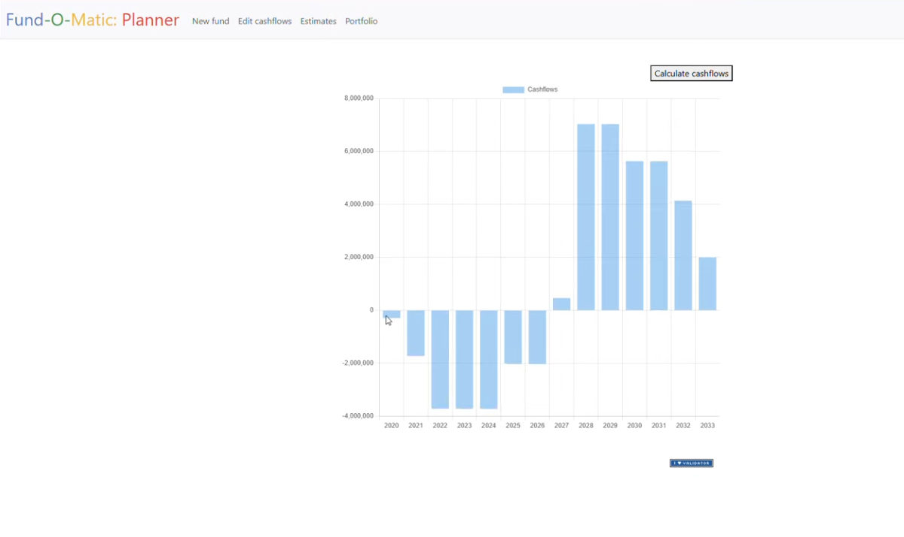

# Final project of CS50x: Fund-O-Matic 

#### Video Demo:  https://youtu.be/ldGxrPLuj5o
#### Description:

### Background
Predicting commitment based funds cash flows is a common problem within the investment community. Many investors have their own tools, whether they are based on Excel, some tailored solution or a paid service.

Commitment based funds, e.g. private equity, private debt and infrastructure funds are a different kind of an investment than the more traditional ones in listed equities or fixed income. The capital that you invest gets drawn or "called" over time, and you need to plan your commitments well so that the investors targeted allocation is met and there is enough cash to cover those capital calls.

With the rise in the popularity of this kind of funds, I thought it would be interesting to make a simple web app to plan fund commitments and future cash flows.

That's why I've created the ***Fund-O-Matic***
>NOTE: The repository for this is private and it can only be shared with potential employers.

### Implementation

Users will need to provide in the app their expectations for the fund returns, durations of fund phases (i.e. investment phase and funds total lifetime), commitment size and year.

*Fund-O-Matic* will calculate the annual cash flows of given fund using an assumption of linear capital calls over the investment period and linear distributions during the harvest period, i.e. the phase after the investment period.

`Investment period cash flow = Commitment / Investment period duration`

`Harvest cash flow = (Commitment * Multiplier) / (Lifetime - investment period)`

These formulae are very simplistic in nature and should be replaced with a more sophisticated planning models, such as *The Takahashi-Alexander Model, a.k.a. the Yale Endowment model*.

Typically fund cashflows are largest in the middle of the phase and taper to the start and end of the phase, much akin to a bell curve. Furthermore, if the fund has a significant "seed portfolio" the capital calls may be heavily skewed to the beginning of the investment period, and if the general partner (GP) is using credit lines to boost their return metrics (i.e. fund IRR) they might delay the capital calls and borrow money from private debt funds or banks instead to fund the investment.

## Technical details

The *Fund-O-Matic* comprises of a SQLite3 database, Python server running Flask and a HTML and Javascript user interface built with Jinja templates.

The app communicates with the SQLite3 database in three ways.
- First, user registers to the app which creates an entry to the user-table in the database. The password is stored hashed, so it should be reasonably secure. No other data is stored of the user in this table than (automatically generated) user id, username and password-hash. Further development could add useful information on this table, such as contact details, allocation target, investor type, etc.
- Second, user inputs his/hers funds in the platform through the "New Fund" page. The app creates an entry to the funds-table with the given details (in addition with the user-id referencing the user-table):
    - Fund name
    - Commitment Size
    - Predicted return multiplier
    - Investment period as an integer
    - Fund lifetime as an integer
    - Investment year

- Third, the application calculates the annual cashflows using the above mentioned details. The formula used is described in the [implementation section](#implementation). In cashflows-table, only the fund-id, year, amount and type of cashflow are stored.

>NOTE: In a functional application, there should be a page for editing the annual cashflows and removing funds from the database but I didn't make that functionality in this project.

## Skills used and learnings from this project

This project built on the knowledge and skills acquired in the very last problem sets of the Harvard CS50 course. Most of the technical solutions were used in the "Finance" problem set, except for the main functionality of this project.

To succesfully complete this project, it was crucial that the web app would be able to graph the annual portfolio level cashflows that the model estimates.

Unfortunately, I had no idea how to do it and I was quite worried when I realised that HTML doesn't have any graphing functions and I had to use Javascript to create a graph for the web app. Oh yeah, Javascript was **the** area in the whole CS50 course that I felt the least confident in.

I got familiar with Chart.js graphing package and tried following different examples from online before trying to create a HTTP request from the server to retrieve a JSON-datastructure to process on client side. I was fairly confident that the SQLite command was correct but it took multiple hours of figuring out error messages and then the lack of error messages and output on the web app, but I finally got it.

>NOTE: The project has minimum functionalities and should be expanded in order to make this an actually useful tool.

TO DO:
- [ ] Create a page for editing cashflows
- [ ] Implement a button to delete a fund and it's associated cashflows

