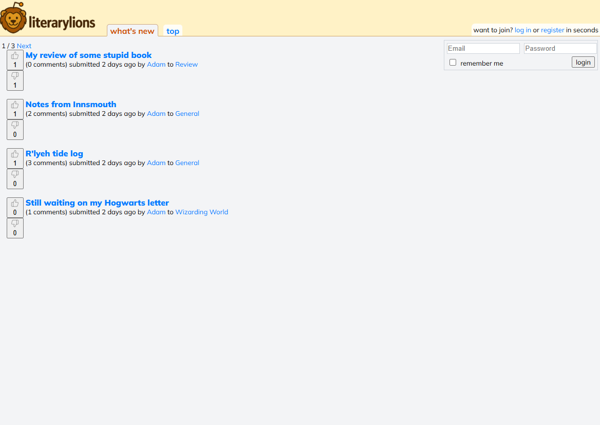
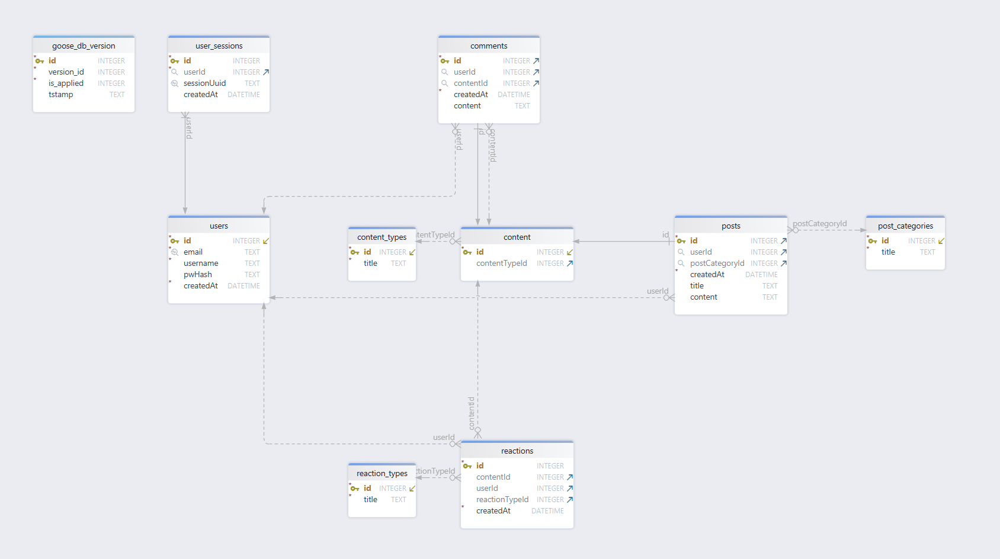

# Literary Lions Forum
A full-stack discussion forum built with Go and SQLite



>NOTE: The repository for this is private and it can only be shared with potential employers.

## Overview
This project is a web-based forum application that allows users to create posts, comment on discussions, and react to content. It was developed as part of the kood/Sisu Go-module to demonstrate backend web development, database design, and authentication concepts.

## Quick start
``` bash
git clone https://gitea.kood.tech/marttikoivisto/forum.git
cd forum
# Local
go run .

# Docker
docker compose up --build
```
Visit http://localhost:8080/ for access to the forum. You can register a new user or use the test user:
- login email: test@test.fi 
- password: test

>NOTE: If you want to run the project in a Docker container, you need to install Docker Desktop on your device: 
>https://docs.docker.com/get-started/get-docker/

## Learning objectives
The key learning objectives were:
- The basics of web development: HTML, HTTP, sessions, and cookies.
- Using and setting up Docker.
- SQL language and database manipulation.
- The basics of encryption.
- Docker essentials: Installation, configuration, image creation, container management, and best practices.

## Features
- User registration and login
- Create posts
- Like/dislike reactions
- Access control for authenticated users
- Advanced encryption using bcrypt
- Search functionality
- Profile pages for account actions and seeing users own interactions
- Configured to run in a Docker container
- SQLite database for data preservation

### Extra features
- User account deletion and delete confirmation 
- User page for comments and posts by user
- Nested comments
- Post category creation
 

### Tech stack
- Backend: Go (net/http)
- Database: SQLite
- Frontend: HTML, CSS, Go templates
- Build & Deployment: Docker

## Project structure
```
/assets         ->  Static files (CSS, images, templates)
/data           ->  Database
/forumdb        ->  Database queries
/model          ->  Defined Go-structs to reflect the database
/model/sqlite   ->  Database queries directly related to the structs mentioned above
. (root)        ->  Main files relevant for running, building and deploying the server.
```

## Installing

The project can be installed by cloning the repo. The database is established first time that the project 
is executed.
``` bash
git clone https://gitea.kood.tech/marttikoivisto/forum.git
cd forum
go run .
```

### Database setup

The server will establish the database first time its ran but it can also be setup separately.

To establish the database outside of the main.go, you'll need to use goose.
``` bash
goose -dir=assets/migrations sqlite3 ./data/app.db up
```

## Running the project in a Docker container
``` bash
docker compose up --build
```
If you have Docker Desktop installed, you can find the container in the "Containers" tab. There you can stop and restart the container without building it again.

## Database structure


## Database troubleshooting 
If there has been edits to the database migration files, you may need to use one of these commnands (first one undoes latest update, second one wipes all the previous migrations)

``` bash
goose -dir=assets/migrations sqlite3 ./data/app.db down
goose -dir=assets/migrations sqlite3 ./data/app.db down-to 0
```

## Future development ideas
Here are some ideas for further improving the project
- Admin/moderator capabilities and interface
