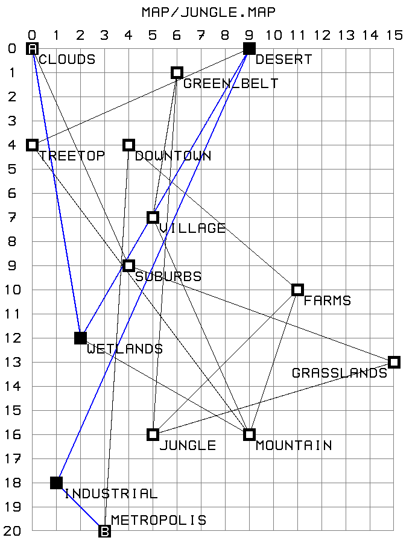

# 🚆 Pathfinding algorithm/simulator #



A Go-based multi-train routing, visualization & pathfinding engine

This project is a pathfinding and simulation tool for routing multiple trains through a railway network.
It supports BFS, DFS, Dijkstra, and A* algorithms, detects station capacity conflicts, and can generate PNG visualizations of the railway graph.

First go to gitea repository. You will find the link from kood/sisu site. Then either open with vscode or type `git clone https://gitea.kood.tech/pyryvainikainen/pathfinder` to your terminal.

>NOTE: Repository is private and it can only be shared with potential employers.

## ▶️ Running the Program ##
**Basic usage**

go run . [MAP_FILE] [START_STATION] [END_STATION] [NUM_TRAINS]

If using the included maps, you will need to use directory name `map/` in front of map file. Example of this format below.

**Example:** 

`go run . map/network.map waterloo st_pancras 4`
 
 ```sh
T1-victoria T2-euston 
T1-st_pancras T2-st_pancras T3-victoria T4-euston 
T3-st_pancras T4-st_pancras 
 ```

### Optional flags: ###
| Flag | Description |
| --- | --- |
| `-h` or `--help` | Print Help |
| `-r` or `--render` | Runs the pathfinder and renders a validated map to output.png |
| `-ro` or `--renderonly [MAP_FILE]` | Renders an unvalidated map to output.png, ingores all arguments except [MAP_FILE]. |
| `-v` or `-verbose` | Prints out turns taken and time to calculate |
| `-e=[PV or MK]` or `-engine=[PV or MK]` | Changes the pathfinding engine that the program uses. Default option is PV but MK has further algorithm optionality. 
| ` -engine=MK-[algorithm]` | MK engine supports the following algorithms: Depth-First Search (dfs), Breadth-First Search (bfs), Dijkstra (dijkstra) and A* (a*). The optionality can be triggered with extra specifier, for example -engine=MK-dijkstra

Note! *Options must be entered before any arguments.* 

Note! *Rendering will output to `output.png` in the base directory. Existing file will be overwritten.* 

**Example:** Run pathfinder for map/london.map from station 'waterloo' to station 'st_pancras' for 4 trains:

`go run . map/london.map waterloo st_pancras 4`

**Example:** Run pathfinder and render the map map/beethoven.map from station 'beethoven' to station 'part' for 9 trains:

`go run . -render map/beethoven.map beethoven part 9`

**Example:** only render the map map/jungle.map to:

`go run . -renderonly map/jungle.map`

**Example:** Run pathfinder from station '125' to '9875' using the Dijkstra algorithm and finding out the execution time, you could use the following parameters:

`go run . -engine=MK-dijkstra -verbose map/100x100_grid.map 125 9875 10`

## Pathfinding Engines ##
- `PV`, the default option. BFS-based preprocessing for static maps. Fast and scalable due to minimal on-the-fly processing.
- `MK`, the more dynamic on-the-fly engine with various options.

## Automated testing & coverage ##

Following automated tests cover both pathfinding engines and are supplied in `app/app_test.go`:

- It can find more than one route for 2 trains between waterloo and st_pancras for the London Network Map
- It finds more than one valid route for 3 trains between waterloo and st_pancras in the London Network Map
- It finds more than one valid route for 4 trains between waterloo and st_pancras in the London Network Map
- It finds more than one valid route for 100 trains between waterloo and st_pancras in the London Network Map
- It finds only a single valid route for 1 train between waterloo and st_pancras in the London Network Map
- It completes the movements in no more than 6 turns for 4 trains between bond_square and space_port
- It completes the movements in no more than 8 turns for 10 trains between jungle and desert
- It completes the movements in no more than 11 turns for 20 trains between beginning and terminus
- It completes the movements in no more than 6 turns for 4 trains between two and four
- It completes the movements in no more than 6 turns for 9 trains between beethoven and part
- It completes the movements in no more than 8 turns for 9 trains between small and large


All automated tests can be run with `'go test ./...'` which reports if a package has automated tests and whether they succeed or fail.

## Lessons learnt ##
While working on the project, we've had to solve many problems that we have not encountered before and we have become more comfortable with different topics. To name a few:
- Implementing pathfinding algorithms 
- Measuring execution time in Go
- Usage of flags-package, instead of using os.Args to parse them
- Testing in Go
- Image generation, working with spritemaps
- Generating shapes in images